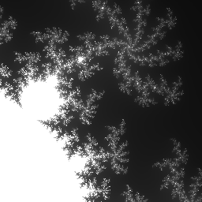

# fracatal



## Build & run

With g++ and make

Build:
```
make
```

Run:
```
make run
```

## Controls

| Key(s) | Action |
|--------|--------|
| WASD   | Move |
| Up/Down | Zoom in/out |
| R | Reset |
| Space | Take a screenshot (generated in `screenshot.bmp`) |

